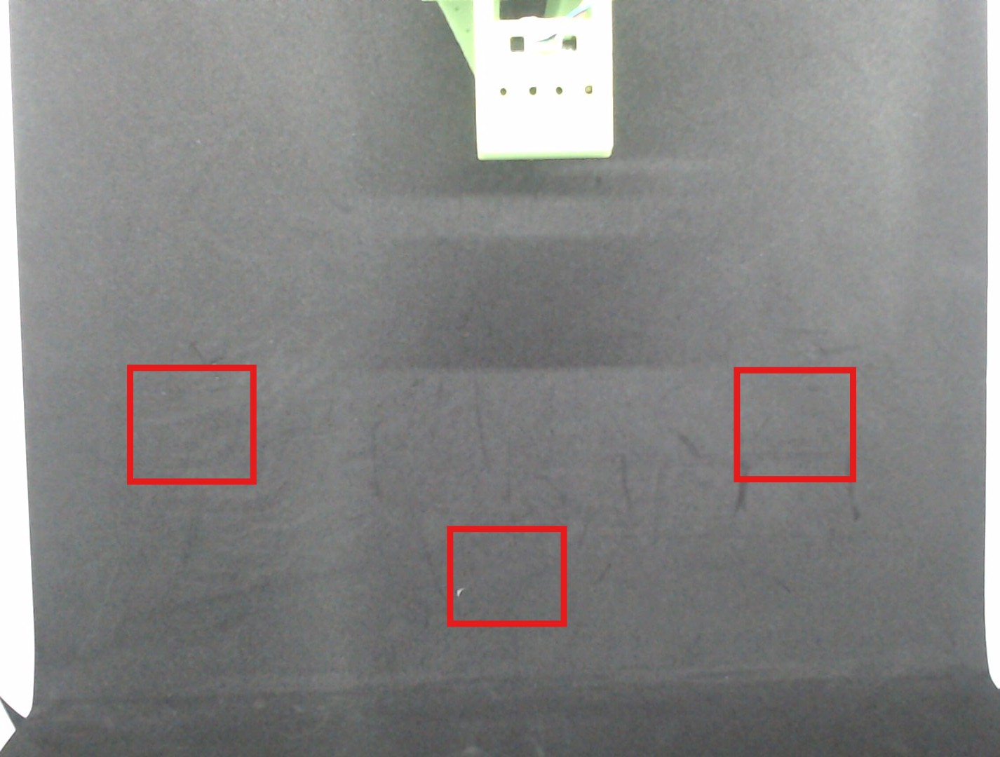

# LeRobot Setup with Mini Studio Guide

This documentation shows how to setup the LeRobot SO-101 dual-arm teleoperation system.

# Step 1: Installation
For installation instruction refer to [Lerobot README](LEROBOT_README.md).

# Step 2: Mini studio setup
Setup the mini studio and Lerobot as per below image.


# Step 3: Hardware Connection

1. Connect Follower and Leader Arm to USB port
2. Power both arms with their DC adapters
3. Check Follower and Leader Arm COM port number

To check the COM port number, run below command. Make sure to activate lerobot environment.

Activate conda evn:
```
conda activate lerobot
```
Check COM port number:

```
lerobot-find-port
``` 

# Step 4: Run Lerobot Demo

# Calibration
It may request for calibration file. If no file exist or required to calibrate follow guideline on how to do calibration from [Lerobot](https://huggingface.co/docs/lerobot/so101?calibrate_leader=Command).


# Teleoperation Demo

Setup together Leader arm for teleoperation demo. Then run below command to run teleoperation demo. 
```
lerobot-teleoperate 
--robot.type=so101_follower 
--robot.port=<insert the Follower Arm COM port number> 
--robot.id=follower_one 
--robot.cameras "{bottom: {type: opencv, index_or_path: 1, width: 640, height: 480, fps: 30}, top: {type: opencv, index_or_path: 0, width: 640, height: 480, fps: 30}}" 
--teleop.type=so101_leader 
--teleop.port=<insert the Leader Arm COM port number> 
--teleop.id=leader_one 
--display_data=true
```
When setup for teleoperation demo, Leader arm and follower arm can be setup side to side or front to back depend on suitability of the place. Refer below image for setup suggestions.

# Deploy Trained Policy Demo

To run the Lerobot with trained AI model, run below command
```
lerobot-record 
--robot.type=so101_follower 
--robot.port=<insert the Follower Arm COM port number> 
--robot.id=follower_one 
--robot.cameras "{bottom: {type: opencv, index_or_path: 1, width: 640, height: 480, fps: 30}, top: {type: opencv, index_or_path: 0, width: 640, height: 480, fps: 30}}" 
--display_data=true 
--dataset.repo_id=<insert own repo_if/local>
--dataset.num_episodes=1 --dataset.episode_time_s=600 
--dataset.reset_time_s=60 
--dataset.single_task="Pickup and insert white block into cup" 
--policypath=C:\Users\User\Documents\reuben_ws\lerobot\outputs\train\act_mini_studio_block_in_cup_redo\checkpoints\last\pretrained_model 
--dataset.push_to_hub=false
```
During demonstration, try to place the block at these positions. See image below.



## Lerobot


